# Játék webáruház

Egy konzol és PC-s játékokat árusító cég online webáruháza. A weboldalon keresztül a felhasználók játékokat tudnak rendelni. 

## Funkcionális követelmények
- A wehshopban lehetőség van keresésre
- Lehetőség nyílik platform szerint szűkíteni a keresést
- A felhasználó szűkítheti a keresését ár, kategória szerint
- Egy oldalon legfeljebb 25 termék jelenik meg, az címével, árával, gyártóval
- A felhasználó kosarába tudja helyezni a kiválasztott terméket, akár egyszerre többet is
- A kosárból a termékek bármikor törölhetőek, illetve darabszámot is adhat meg
- A rendelés előtt a felhasználó még egyszer áttekintheti a kosár tartalmát
- Csak regisztrált felhasználó adhatja le a rendelését
- A regisztráció során a rendszer elmenti az adatokat, és azok helyes megadásával a felhasználó később bejelentkezhet a rendszerbe
- Lehetőség van bankkártyás és utánvételes fizetésre is

## Nem funkcionális követelmények
- A weboldalt a felhasználó tetszőleges böngészőből tudja elérni
- Számítógépen, mobiltelefonon és tableten is megfelelően jelenik meg
- A regisztrált felhasználók adatait más felhasználó nem érheti el
- A jelszavak mentésére hashellést használ a rendszer
- A fejlesztés során használt technológiák:
	- Java Spring Boot
	- HTML
	- CSS (Bootstrap)
	- MYSQL adatbázisrendszer
	- Angular JS
	- Typescript
	
## Szerepkörök
- Adminisztrátor: frissítheti az adatbázis 
- Felhasználó: rendeléseket adhat le

## Fejlesztői környezet
- IntelliJ IDEA
- Visual Studio Code
- Verziókezelő: Git
- Postman
- Uniserver

## Adatbázis terv

## Adatbázis kapcsolatok:
- egy-egy kapcsolat:
	- Order - Status
- egy-sok kapcsolat:
	- OrderItem - Game
	- OrderItem - Order
	- Order - User 
	- Developer - Game
- sok-sok kapcsolat:
	- Category - Game 
	
## Alkalmazott könyvtárstruktúra:

- Role annotáció:
	Az authorizációban van segitségünkre. A controllerben található végpontokra tehetünk annotációt,
	mely ellenőrzi, hogy van-e jogosultságunk végrehajtani.
	

- RoleAspect:
	Gyakorlatilag ez az osztály végzi az authorizációt, ellenőrzi, hogy a felannotált függvény controllerben található metódus-e,
	ha igen akkor további feltételeket ellenőriz. A checkToken metódus lekéri a HttpServletRequest paraméterből a felhasználó 
	Tokenjét, ami alapján kikereshető az adatbázisból, igy meg tudjuk állapitani hogy van-e kellő jogosultsága végrehajtani a függvény.
	Ha nincs, hibát dobunk, ha van, akkor engedjük lefutni a metódust.

	

- Controllerek:

	- Ezen osztályok tartalmazzák a használt végpontokat, itt történik az authorizáció is. (A változtatás jogát fenntartjuk, a frontend
	még nincs kész, igy előfordulhat, hogy további végpontokat kell létrehoznunk, illetve a meglévőket szükséges módositanunk.)
	

- CategoryController:
	
	

- DeveloperController:
	

	
- GameController:
	

	
- OrderController
	

	
- StatusController
	

- UserController
	

	
- Entities: Ezen osztályok reprezentálják az adatbázis tábláit, a táblák nevei, oszlopnevei megegyeznek az adatbázis UML-en található
adatokkal. (Note: Jelen pillanatban, 2017.december.3-án, eltérések tapasztalhatóak a két forrás között, azonban a végleges dokumentációban
az adatok meg fognak egyezni.)

- Request: Ebben a package-ban található DTO osztályok a frontend és a backend kommunikációját hivatottak elősegiteni.

- Response: Ez a Token osztál tartalmazza azokat az információkat, mely segitségével a Http kérés Header szekciójában, át tudjuk adni a frontendnek
az éppen bejelentkezett felhasználó Tokenjét.

- Repository: Itt találhatóak az egyes entitásokhoz tartozó CrudRepository interfacek, melyek tartalmazzák az adatbázis-kezeléshez szükséges 
metódusokat, amiket a service osztályok használnak.

- Service: Ezen osztályok felelősek a Controllerek és az adatbázis-táblál közti kommunikációért.

- CategoryService:

- DeveloperService:

- GameService:

- OrderService:

- StatusService:

- UserService:

## Használt Dependency-k:

- spring-boot-starter-data-jpa
- spring-boot-devtools
- spring-boot-devtools
- h2
- lombok
- spring-boot-starter-test
- mysql-connector-java
- spring-security-crypto
- spring-boot-starter-aop

# Felhasználói dokumentáció

## Alkalmazás célja
A Webshop alkalmazás az ELTE Informatikai Kar Alkalmazások fejlesztése tárgyának beadandójaként készült. Célja játék szotfverek eledását támogató oldal. Az alkalmazás egy webes felületet nyújt a felhasználók számára, amely reszponzív is egyben.

## A webes felület

## Főoldal
A felhasználót (amennyiben nincs bejelntkezve) alapérezlemezeten a login oldal köszönti. Itt lehetőség van a már meglévő felhasználóknak bejelentkezni vagy a "Register" gomb megnyomásával regisztrálni magát az adatbázisba. 

A bejelentkezés egyszerű folyamat, csak a felhasználónevet és a jelszót kell megadnia a felhasználónak. Amennyiben a bevitt adatok helyesek, a felhasználót a webshop kínálata fogadja. Ha rosszul adott meg adatokat akkor a bejelentkezés oldalon marad a felhasználó.

A regisztrációra kattintva a felhaználó egy másik oldalra kerül. Itt meg kell adnia a kívánt felhasználónevét, jelszavát, e-mailt címét, keresztnevét, vezetéknevét, és a címét. Minden adatot megadva a Register gomb kiélénkül és aktívá válik. Ezt megnyomva a felhasználó beregisztrálja magát User-ként az adatbázisba. 

Ha mégis már regisztrált felhasználók vagyunk, akkor van lehetőségünk a "Go to login" gombbal visszalépni a bejelentkező folyamatba.

## Store oldal
Bejelentkezve a felhasználót a store oldal fogadja. Itt tudd kedvére böngészni a neki megfelelő játékok között. Az oldal felépítése angyon egyszerű és letisztult. A fejlécben alapérezlemezeten 4 menüpont van. A Webshop-ra kattintva visszaugrik a storeba, a Store-ra kattintva szintén. A Cart-ra kattinva a felhasználó eléri a bevásárló kosarát. A Log out-ra kattintva pedig kijelentkezik és átdobja a Login oldalra. 

Adminként plusz két funkcióval bővül a fejléc. Az Add game menüpontban tudd új játékokat felvinni az adatbázsiba, az Add developer-ben tud új fejlesztőket felvinni az adatbázisba, illetve az Add category-val tudd újabb játékkategóriákat felvinni. 

A Store oldalon lehetőség van játékokra nevük szerint keresni, ez részszavak esetén is működik. Lehet ár szerint filterezni a játékokat. Illetve lehet kategória és platform szerint is szűkiteni. Erre az Advanced search-re kell kattintani.

A játékokat kártyáján látszódik a játék képe, ára, neve, fejlesztője és kategóriája. Illetve alul alapérezlemezeten egy gomb van ezzel lehet a kosárba rakni a terméket, ahányszor rányom a felhasználó annyi mennyiség kerül a kosárba. Adminként megjelenik egy Delete gomb is amivel a játékot ki lehet törölni az adatbázisból.

##Basket oldal
Itt ha nem rakott a felhasználó a kosarába még semmit egy üzenet és egy gomb fogadja, amivel visszatud navigálni a store-ba.

Ha vannak a kosarába termékek akko azokat itt felsolva látja a mennyiségével együtt amit növelni és csökkenteni tudd a megfelelő gombokkal. Illet törölni is tudja azokat.

Ha kártyával kíván fizetni azt be tudja jelölni itt, és megtudja redelni a termékeket. 

## Frontend könyvtárstruktúra
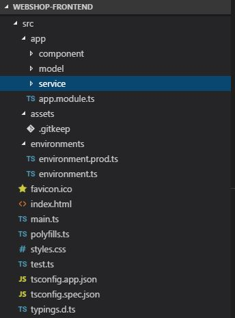

## Frontend szervízek
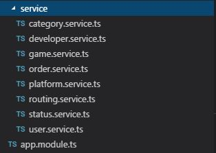

## Frontend modellek
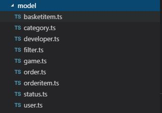

## Frontend 
A modellek megegyeznek a backendbe lévőekkel
-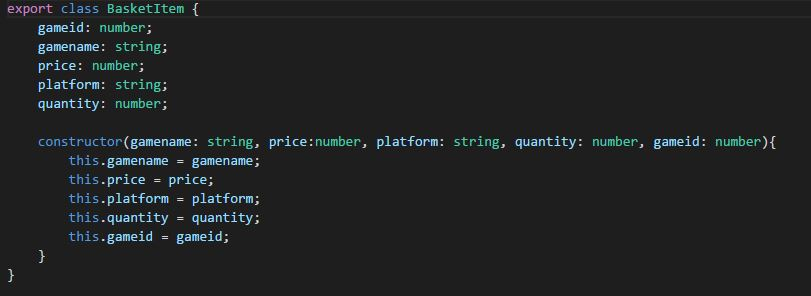
-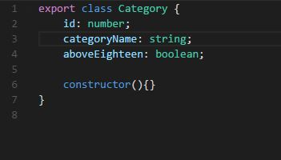
-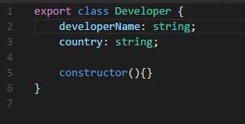
-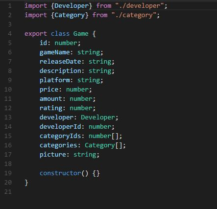
-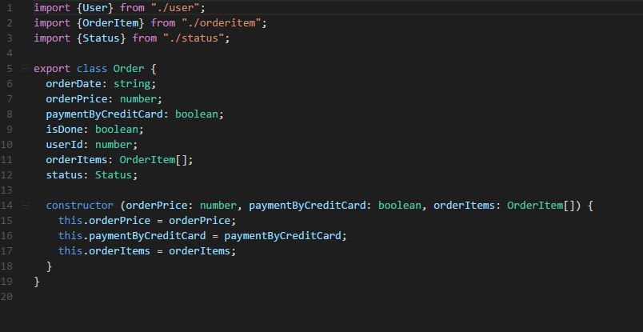
-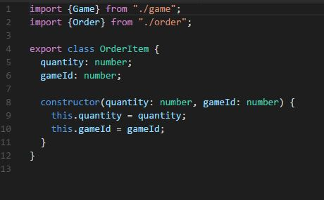
-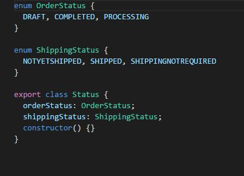
-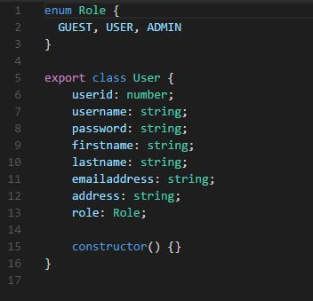