# Játék webáruház

Egy konzol és PC-s játékokat árusító cég online webáruháza. A weboldalon keresztül a felhasználók játékokat tudnak rendelni. 

## Funkcionális követelmények
- Minden oldalon megjelenik egy kereső, ahol a termékek között lehet böngészni
- Lehetőség nyílik platform szerint szűkíteni a keresést
- A felhasználó szűkítheti a keresését ár, megjelenés, kategória szerint
- Egy oldalon legfeljebb 25 termék jelenik meg, az címével, árával, gyártóval és megjelenési dátumával
- Egy termékre kattintva megjelenik a részletes leírása, gépigénye stb.
- A felhasználó kosarába tudja helyezni a kiválasztott terméket, akár egyszerre többet is
- A kosárból a termékek bármikor törölhetőek, illetve darabszámot is adhat meg
- A rendelés előtt a felhasználó még egyszer áttekintheti a kosár tartalmát
- Adatai leadásával vagy regisztrált felhasználó esetén bejelentkezéssel adhatja le a rendelését(feltéve ha megadott minden szükséges adatot)
- A regisztráció során a rendszer elmenti az adatokat, és azok helyes megadásával a felhasználó később bejelentkezhet a rendszerbe
- Lehetőség van kupon beváltására is, ezt a felhasználónak a rendelése leadása során jeleznie kell
- A főoldalon megjelenek a legújabb illetve a legkeresettebb játékok is
- Lehetőség van bankkártyás és utánvételes fizetésre is

## Nem funkcionális követelmények
- A weboldalt a felhasználó tetszőleges böngészőből tudja elérni
- Számítógépen, mobiltelefonon és tableten is megfelelően jelenik meg
- A regisztrált felhasználók adatait más felhasználó nem érheti el
- A jelszavak mentésére hashellést használ a rendszer
- A fejlesztés során használt technológiák:
	- Java Spring Boot
	- HTML
	- CSS (Bootstrap)
	- MYSQL adatbázisrendszer
	- Angular JS
	- Typescript
	
## Szerepkörök
- Adminisztrátor: frissítheti az adatbázis illetve felhasználókat törölhet a rendszerből, megtekintheti a a felhasználók által leadott rendeléseket és moderálhatja a termék értékeléseket
- Felhasználó: rendeléseket adhat le és nyomon követheti azokat, értékelheti a terméket
- Látogató: nem regisztrált, de ugyanúgy rendelhet, viszont értékelést nem írhat

## Fejlesztői környezet
- IntelliJ IDEA
- Visual Studio Code
- Verziókezelő: Git
- Postman
- Uniserver

## Adatbázis terv

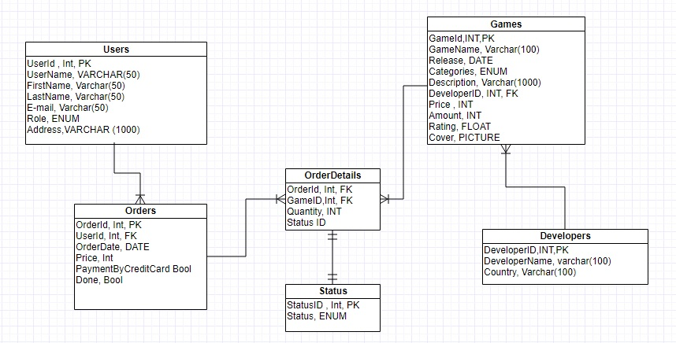

## Adatbázis kapcsolatok:
- egy-egy kapcsolat:
	- Order - Status
- egy-sok kapcsolat:
	- OrderItem - Game
	- OrderItem - Order
	- Order - User 
	- Developer - Game
- sok-sok kapcsolat:
	- Category - Game 
	
## Alkalmazott könyvtárstruktúra:

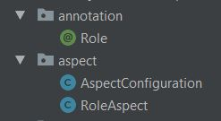

- Role annotáció:
	Az authorizációban van segitségünkre. A controllerben található végpontokra tehetünk annotációt,
	mely ellenőrzi, hogy van-e jogosultságunk végrehajtani.
	
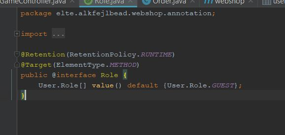

- RoleAspect:
	Gyakorlatilag ez az osztály végzi az authorizációt, ellenőrzi, hogy a felannotált függvény controllerben található metódus-e,
	ha igen akkor további feltételeket ellenőriz. A checkToken metódus lekéri a HttpServletRequest paraméterből a felhasználó 
	Tokenjét, ami alapján kikereshető az adatbázisból, igy meg tudjuk állapitani hogy van-e kellő jogosultsága végrehajtani a függvény.
	Ha nincs, hibát dobunk, ha van, akkor engedjük lefutni a metódust.

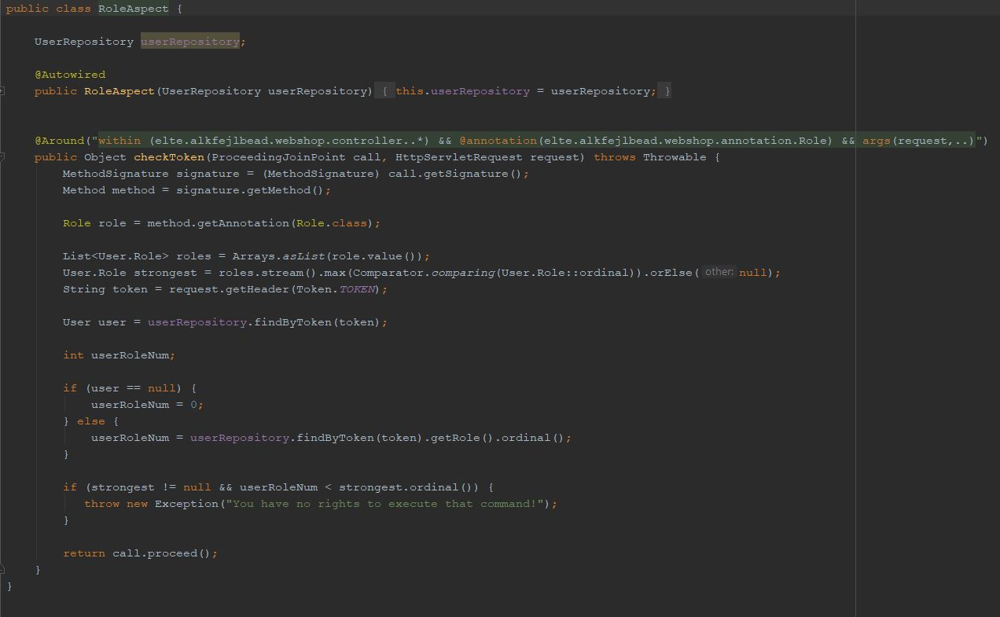	

- Controllerek:

	- Ezen osztályok tartalmazzák a használt végpontokat, itt történik az authorizáció is. (A változtatás jogát fenntartjuk, a frontend
	még nincs kész, igy előfordulhat, hogy további végpontokat kell létrehoznunk, illetve a meglévőket szükséges módositanunk.)
	
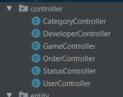

- CategoryController:
	
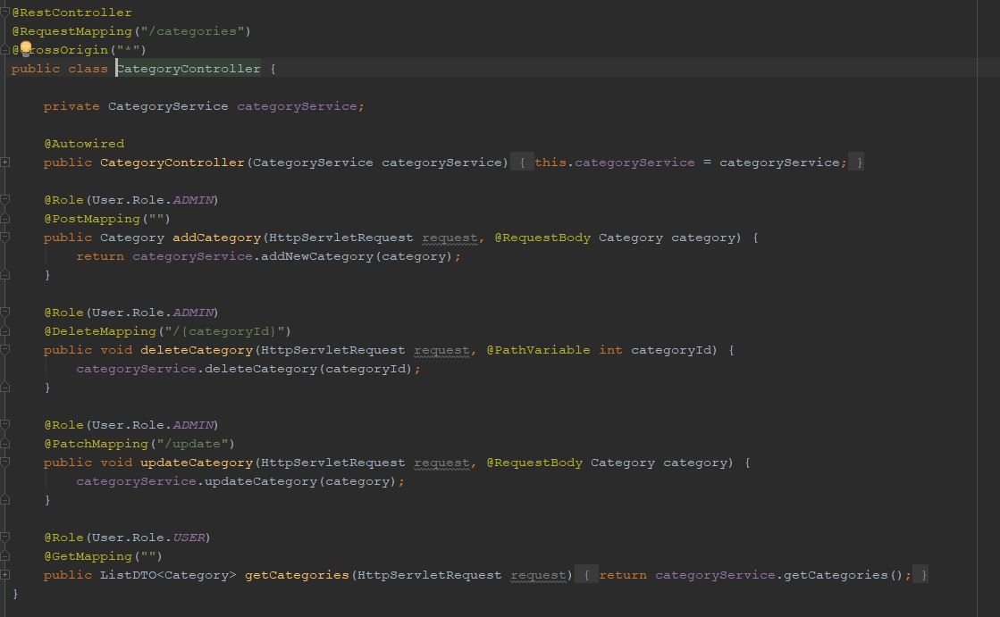	

- DeveloperController:
	
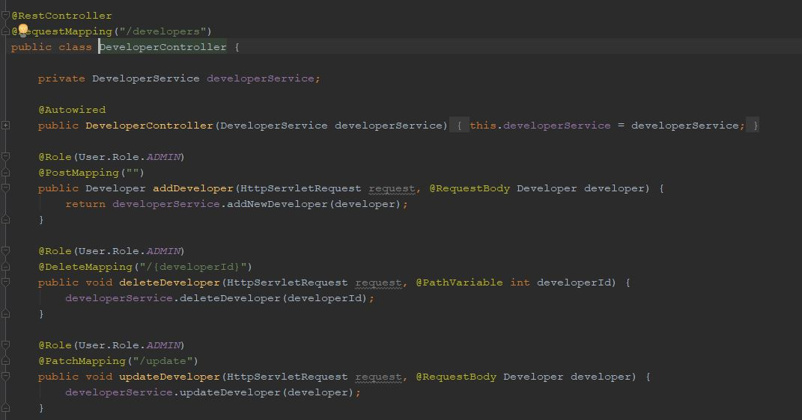
	
- GameController:
	
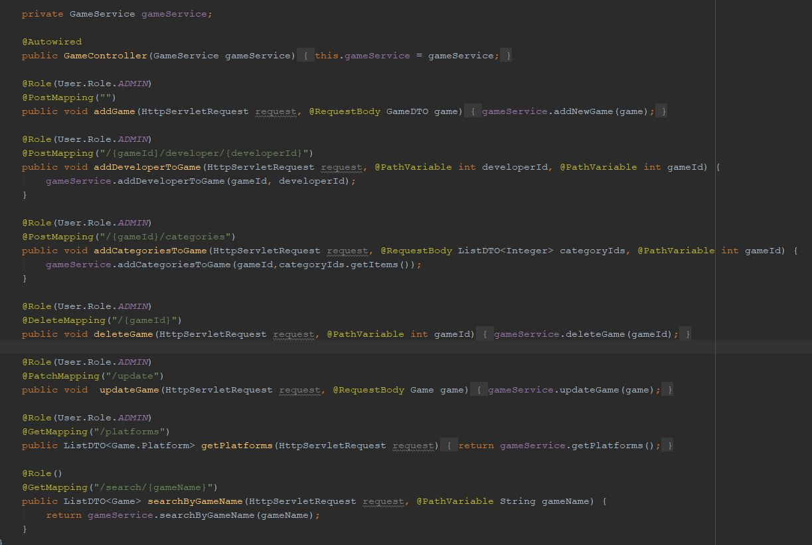
	
- OrderController
	
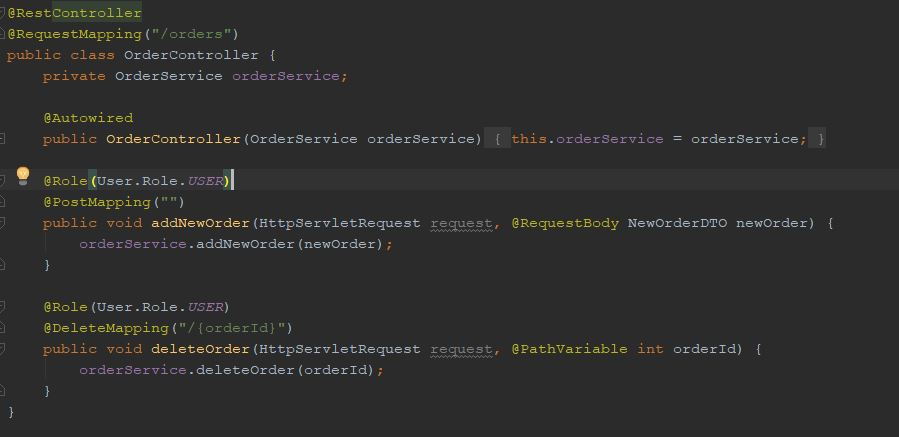
	
- StatusController
	
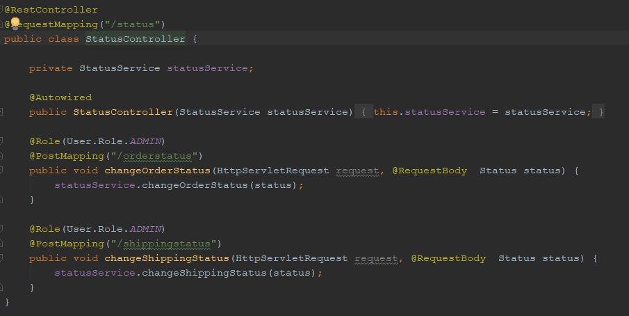

- UserController
	
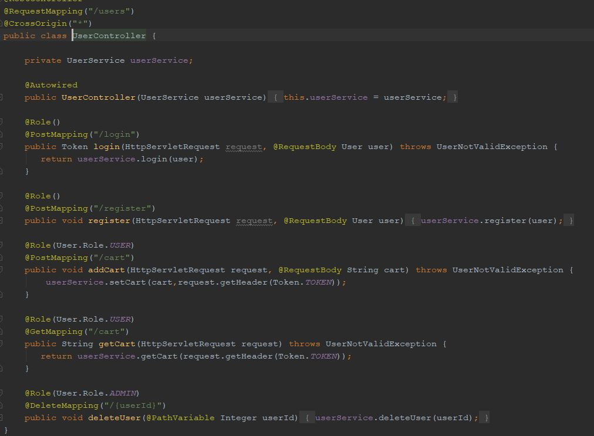
	
- Entities: Ezen osztályok reprezentálják az adatbázis tábláit, a táblák nevei, oszlopnevei megegyeznek az adatbázis UML-en található
adatokkal. (Note: Jelen pillanatban, 2017.december.3-án, eltérések tapasztalhatóak a két forrás között, azonban a végleges dokumentációban
az adatok meg fognak egyezni.)

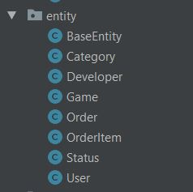

- Request: Ebben a package-ban található DTO osztályok a frontend és a backend kommunikációját hivatottak elősegiteni.

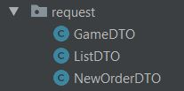

- Response: Ez a Token osztál tartalmazza azokat az információkat, mely segitségével a Http kérés Header szekciójában, át tudjuk adni a frontendnek
az éppen bejelentkezett felhasználó Tokenjét.

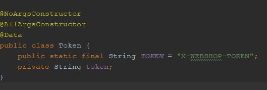

- Repository: Itt találhatóak az egyes entitásokhoz tartozó CrudRepository interfacek, melyek tartalmazzák az adatbázis-kezeléshez szükséges 
metódusokat, amiket a service osztályok használnak.

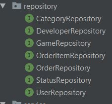

- Service: Ezen osztályok felelősek a Controllerek és az adatbázis-táblál közti kommunikációért.

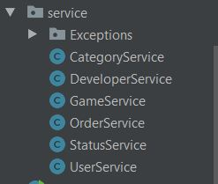

- CategoryService:

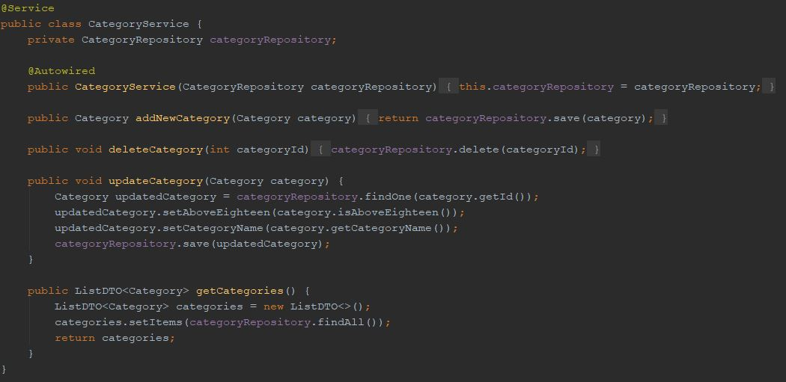

- DeveloperService:

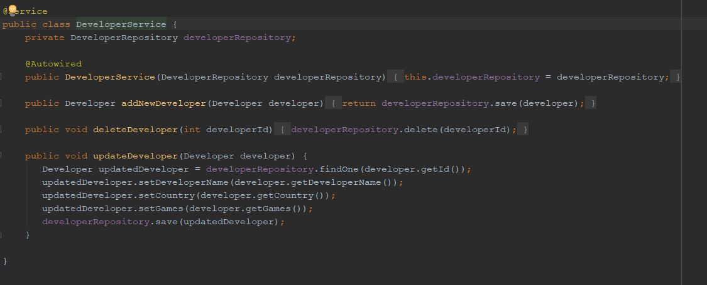

- GameService:

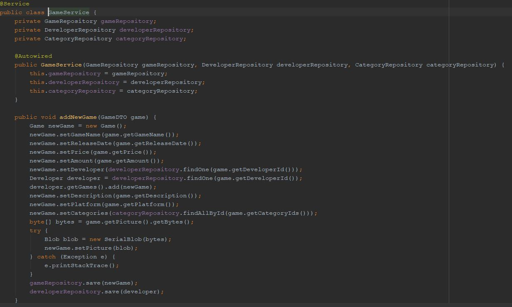
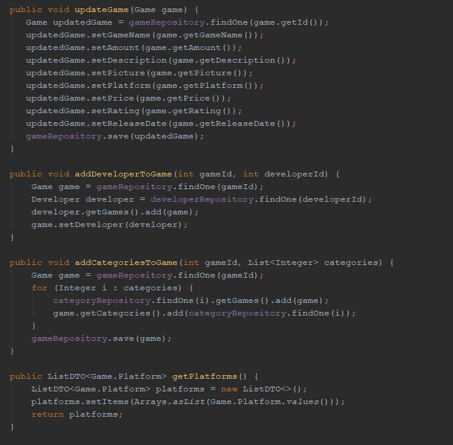
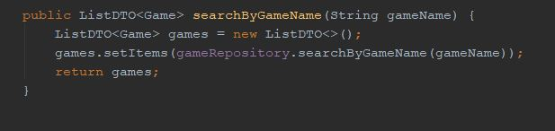

- OrderService:

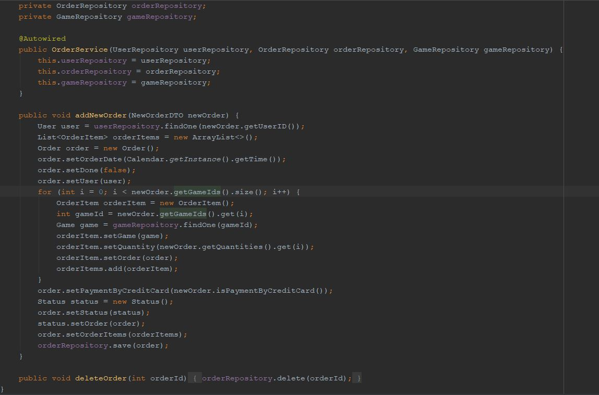

- StatusService:

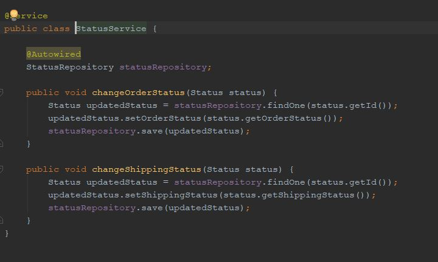

- UserService:

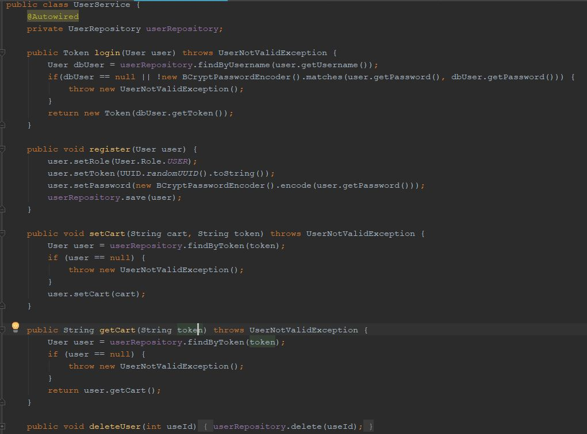

## Használt Dependency-k:

- spring-boot-starter-data-jpa
- spring-boot-devtools
- spring-boot-devtools
- h2
- lombok
- spring-boot-starter-test
- mysql-connector-java
- spring-security-crypto
- spring-boot-starter-aop
